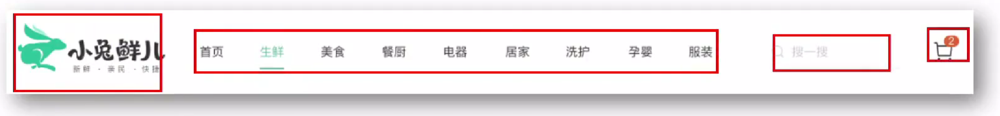
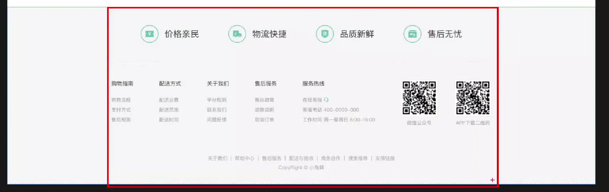
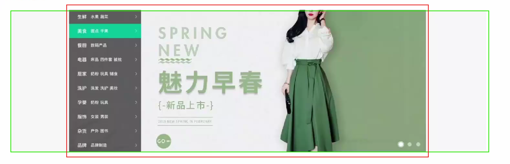
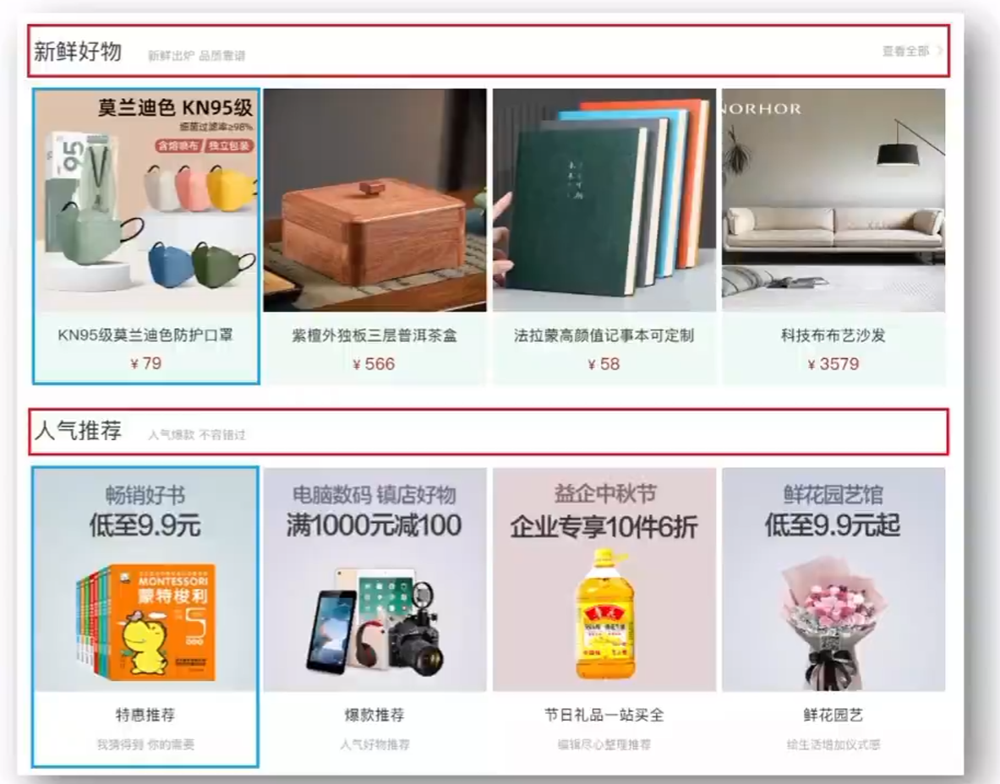
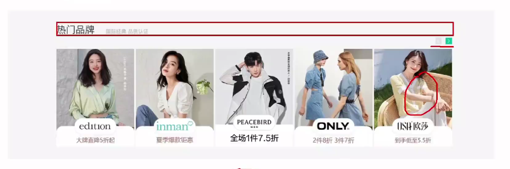
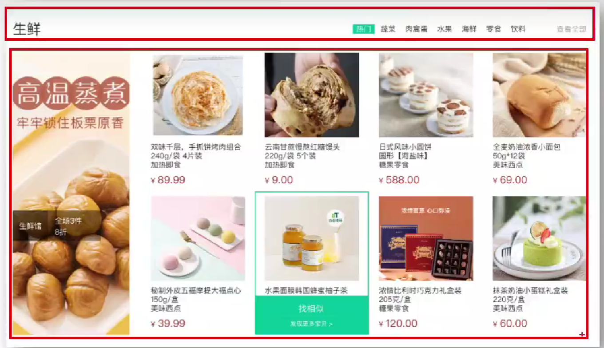
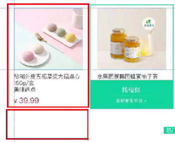
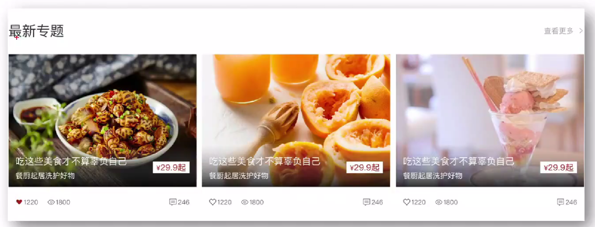
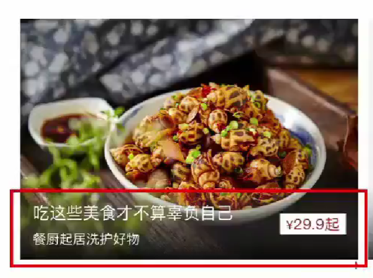

<a id="mulu">目录</a>
<a href="#mulu" class="back">回到目录</a>
<style>
    .back{width:40px;height:40px;display:inline-block;line-height:20px;font-size:20px;background-color:lightyellow;position: fixed;bottom:50px;right:50px;z-index:999;border:2px solid pink;opacity:0.3;transition:all 0.3s;color:green;}
    .back:hover{color:red;opacity:1}
    img{vertical-align:bottom;}
</style>
<!-- @import "[TOC]" {cmd="toc" depthFrom=3 depthTo=6 orderedList=false} -->

<!-- code_chunk_output -->

- [大致介绍](#大致介绍)
    - [项目目录](#项目目录)
- [SEO](#seo)
- [网页图标](#网页图标)
- [版心](#版心)
- [快捷导航区域shortcut](#快捷导航区域shortcut)
- [头部header](#头部header)
    - [logo](#logo)
    - [导航](#导航)
    - [搜索](#搜索)
    - [购物车](#购物车)
- [底部footer](#底部footer)
    - [服务](#服务)
    - [帮助中心](#帮助中心)
    - [版权](#版权)
- [banner区域](#banner区域)
    - [轮播图](#轮播图)
    - [侧导航](#侧导航)
    - [圆点](#圆点)
- [新鲜好物goods](#新鲜好物goods)
    - [标题](#标题)
    - [内容](#内容)
- [人气推荐](#人气推荐)
- [热门品牌](#热门品牌)
- [生鲜](#生鲜)
    - [内容](#内容-1)
    - [鼠标悬停效果](#鼠标悬停效果)
- [最新专题](#最新专题)
    - [内容](#内容-2)
    - [悬浮文字](#悬浮文字)

<!-- /code_chunk_output -->

<!-- 打开侧边预览：f1->Markdown Preview Enhanced: open...
只有打开侧边预览时保存才自动更新目录 -->

### 大致介绍
##### 项目目录
**网站根目录**指存放网站的第一层文件夹，内部包含当前网站的所有素材，包括HTML、css、js和图片资源等。
- images文件夹：存放固定使用的图片素材，如logo、样式修饰图等
- uploads文件夹：存放非固定使用的图片素材，如商品图、宣传图等需要上传的图片
- **iconfont文件夹：字体图标**
- css文件夹：存放CSS文件（使用link标签引入）
  - base.css--基础公共样式，如清除默认样式、设置网页基本样式
  - index.css--首页CSS样式
  - **common.css--各个网页相同模块的重复样式，如头/底部**
- index.html：首页HTML文件

注意：先引入base，再是common，最后是index.css。后两个顺序无所谓，但必须先引入base.css
### SEO
网页头部SEO标签：
- title--网页标题标签
- description--网页描述
- keywords--网页关键词

具体HTML写法：
```
<meta name="description" content="description">
<meta name="keywords" content="keywords">
<title>title</title>
```
其中两个meta标签的emmet缩写为`meta:desc`和`meta:kw`
### 网页图标
favicon图标：网页图标，出现在浏览器标题栏
以`.ico`为后缀，一般存放在网站的根目录中
HTML格式：
```
<link rel="shortcut icon" href="favicon.ico" type="image/x-icon">
```
emmet缩写为`link:favicon`
### 版心
**放在common.css中**
```
.wrapper{
    margin: 0 auto;
    width: 1240px;
}
```
### 快捷导航区域shortcut
{:width=30 height=30}
因为各页面都有快捷导航，所以放在common.css中
有背景色：用`通栏>版心>导航ul>li>a`的形式
导航ul右对齐：将主轴对齐方式设置成`flex-end`
li横向排列：设置ul为flex布局
两个li间的小竖线：因为和文字等高，所以是给a加边框以及左右padding（使文字和竖线有间距）
字体图标：因为和文字同一行，直接使用span行内标签
### 头部header
{:width=60 height=60}
标签结构：`.header`>`图标.logo`+`导航.nav`+`搜索.search`+`购物车.cart`
没有背景色，直接用版心
高度设置：取4个div中最高的高度为整个头部的高度，剩余的高度用margintop和bottom补上，即每部分距顶部距离=`.header`+`各部分`的margintop
4个div横向排列：.header使用flex
##### logo
seo优化：使用
```
<div class="logo"><a href="#">小兔鲜儿</a></div>
```
的形式，并设置a的字号为0，给它设置背景图片以显示图标
##### 导航
采用div.nav>ul>li>a的结构，为div.nav添加左右margin，为li添加右margin，导航区域与其右侧搜索区域的间距由这两个右margin一起提供
ul使用flex布局，使li横向排列
a设置底部padding，使hover时底部横线与字有距离
##### 搜索
字体图标和input文本框，使用input的placeholder属性设置默认显示文字
给div.search设置flex使横向排列，字体图标和文本框间距给字体图标加marginright
为使文本框不超过父级div.search的宽度，在设置完字体图标右边距后，设置文本框`flex:1`，此时可能不生效，因为浏览器会优先给定input默认宽度，使用`width:0`去除
##### 购物车
字体图标和它右上角显示的数字
因为这个数字是跟着div.cart的，所以设置子绝父相
数字的左右有空，设置padding
因为数字不确定，所以不能设定宽度，宽度由内容撑开，只指定高度即可
数字的定位：竖直方向用top和bottom均可；水平方向上，因为我们想让数字变长时向右撑开，所以设置left
### 底部footer
{:width=200 height=200}
通栏>版心
从上到下三部分
##### 服务
上下设置padding，左右间距使用flex设置主轴对齐方式
图片使用精灵图设置背景图片，标签用`<h5>`
给li加flex使图片旁边的描述文字横向排在图片右侧
各图片间间距相同，使用`justify-content: space-evenly`
##### 帮助中心
分为左右两部分，使用flex，因为左边的靠左、右边的靠右，所以使用`justify-content: space-between`
左边使用`dl`列表>`dt`标题+`dd`各内容，配合flex使各列表横向排列，给各列表加右margin，且最后一个不加。也可以设定左边的总宽度，然后`justify-content: space-between`，考虑到文字可能更改，还是加右margin更好
右边是`ul`>`li`*2，配合flex使横向排列，每个li内使用`div>img`+`p`，其中div使图片为块级，便于上下排列和设置大小
##### 版权
版权区域不需要SEO优化，直接用`p`>`a`即可，竖线直接用`|`即可
### banner区域
{:width=200 height=200}
版心两侧有灰色背景，因此需要通栏套版心
结构：`通栏`>`版心`>`轮播图(ul.pic)`+`侧导航(subnav>ul)`+`右下圆点(ol)`
因为该区域只有首页有，所以写道`index.css`里
##### 轮播图
让三张图片水平排列（方便后续轮播图展示），因此让ul设置flex
因为只显示第一张图，所以给.wrapper设置`overflow:hidden`
如果ul无法撑下三张大图，出现图片变小的情况，就给ul设置宽度为三张图片的总宽度。也可以给img指定宽度为版心宽度，防止flex子级尺寸弹性伸缩
##### 侧导航
压在图片上面，因此使用子绝父相，在最左上方，top和left均为0
每个li里面都分左右两部分，左边是`div`>`a超链接`，右边是span字体图标，同时给li设置flex使左右排列。为使它们都靠最左/右，在设置完li的左右padding后，使用`space-between`
先给所有a都设为较小a的样式，在单独选择第一个a设为较大a的样式
##### 圆点
压在图片上面，因此使用子绝父相
默认状态下都是大圆点，即两个圆点一大一小重叠，初始时大圆点没有颜色；当选中时让最外层的圆点有背景色，同时更改小圆点的颜色，达到选中时出现的效果
`ol`>`li大圆点`>`i小圆点`
横向排列，使用flex
圆形：`border-radius: 50%`
### 新鲜好物goods
{:width=400 height=400}
分为上面的标题和下面的内容
可以看到新鲜好物区域与底下的人气推荐区域结构类似，因此可使用公共样式
无背景色，直接版心居中即可
##### 标题
分成左右两部分，都靠最边上，使用space-between的flex
左边使用`.left`>`h3`+`p`的flex，注意到p是靠最下面显示，所以使用flex-end侧轴对齐方式
##### 内容
四个块都相同，使用`ul`>`li`>`a`>`图片`+`文字`
li横向排列，使用flex，间距在盒子中间，space-between
### 人气推荐
与新鲜好物基本相同
标题少了右侧的查看全部
内容的文本区域背景色和文字样式不同
### 热门品牌
{:width=300 height=300}
有背景色，使用通栏>版心，标题部分与新鲜好物类似
标题右侧的箭头可以使用绝对定位，脱标，在保持之前布局的基础上额外添加。注意：要使子级在父级下面，给定bottom为负数即可
两个箭头使用`.btn`>`a`+`a`>字体图标，横向排列flex
因为`.brand`和`.title`都设置了margin-top，因此出现外边距塌陷，给`.title`父级`.wrapper`设置`overflow: hidden`可解决，或者也可以使用padding代替margin
### 生鲜
{:width=300 height=300}
标题：左侧的"生鲜"+右侧>菜单`ul`+"查看全部"，还是可以沿用已写好的标题样式，只需添加菜单，并将右侧div和菜单`ul`设为flex使横向布局即可
##### 内容
分为左右两部分，使用flex横向排列+主轴对齐方式space-between
左边直接一张大图`a`>`img`，右边是8个li`a`>`img`+文字，设置ul为flex+`flex-wrap: wrap`
右边的li当鼠标hover时有边框线，为了不让边框线出现时挤压内容，默认设置所有li都有边框线，只是颜色与背景相同
右边的文字部分分为上边的介绍文字和底下的价格，为了方便替换文字，每行文字单独设为一个标签；又为了让无论介绍文字有几行，价格位置都不变，需要单独给上边的介绍文字设为一个div，每个div中有3行
##### 鼠标悬停效果
{:width=200 height=200}
多了边框线和底下找相似的div.cover，为了可能的过渡动画效果，让找相似div默认状态下在li的下面，设定`overflow:hidden`，等到current时再滑上来，同时配合子(.cover)绝父(li)相完成定位
中间的线：使用p标签，设置宽高为线的长度和粗细，背景色为线的颜色，为使线居中显示，使用版心居中的方法--设置`margin: 0 auto`
### 最新专题
{:width=200 height=200}
没有背景色，直接版心居中
标题部分与之前的相同，使用公共样式即可
##### 内容
内容部分使用`ul`>`li`>`a`>`.pic`+`.txt`，同时横向布局flex，并space-between
其中`.txt`分成左右两部分，使用横向布局flex。弹性盒子竖直方向居中，使用侧轴对齐方式`align-items: center`即可
对于底下的字，是字体图标与数字结合，采用`p`>`.iconfont`+`.price`的方式，同时给.left设置flex使两个p横向排列
##### 悬浮文字
{:width=200 height=200}
使用基于图片的子绝父相
同时为它设置渐变背景色，实现图片底部有阴影的效果
分成左右两部分，使用横向布局flex，竖直方向居中，使用侧轴对齐方式`align-items: center`
