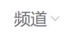
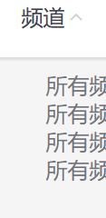
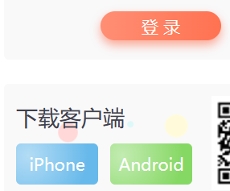
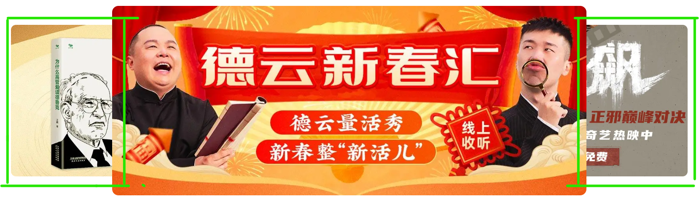
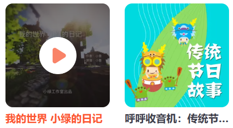

需求：
1. 页面最上面"频道"按钮：当鼠标移到上面时--
    i. 右面的向下箭头变为向上
    ii. 频道列表以平移的方式出现
    {:width=50 height=50}->{:width=100 height=100}
    ```
    /*1-1鼠标进入频道按钮时图标逆时针旋转180°*/
    .x-header-nav .nav-item:hover .icon-down {
        transform: rotate(-180deg);
    }
    .channel-layer {
        transform: translateY(-120px);
        /*初始位置让它往上移动1倍height的位置，使它被遮住*/
    }
    /*1-2频道列表*/
    .x-header-nav .nav-item:hover .channel-layer {
        transform: translateY(0);
        /*注意这里的0是相对原始位置而说的，不是相对上面的transform后的位置*/
        /*所以translateY(0)就表示回到正常位置，可以被看到*/
    }
    ```
2. 为按钮添加不同的渐变
    i. 右下"登录"按钮为径向渐变
    ```
    .x-header-search form .btn {
        background-image: linear-gradient(to right,
            /*从左向右*/
            rgba(255, 255, 255, 0.3),
            /*左侧设置透明色*/
            #f86442);
            /*右侧颜色与按钮本身颜色相同*/
    }
    ```
    ii. 右下下载客户端下面的两个按钮为径向渐变添加高光
    ```
    .download .dl .dl-btn {
        background-image: radial-gradient(50px at 10px 10px,
            /*径向渐变*/
            rgba(255, 255, 255, 0.5),
            transparent);
            /*四周设为透明，相当于显示它本身的颜色*/
    }
    ```
    {:width=100 height=100}
3. 页面中间轮播图添加左右两个小图
   {:width=100 height=100}
    ```
    .banner .banner-list .banner-item.left {
        transform: translate(-160px) scale(0.8);
        /*往左移并缩小，160是左图左侧距中间图左侧的距离*/
        /*此时会出现问题，即基于中心点缩放后，左图左侧距中间图左侧的距离不再是160*/
        /*解决办法：更改160数值，或者基于左侧中点缩放，这样确保左图左边界位置不变，即距中间图左侧的距离不变*/
        transform-origin: left center;
        /*基于左中点进行缩小*/
        }
    .banner .banner-list .banner-item.right {
        transform: translate(160px) scale(0.8);
        /*右图同理*/
        transform-origin: right center;
    }
    ```
4. "猜你喜欢"下面5个视频添加播放按钮，同时出现播放按钮时图片缩放，出现阴影遮罩
   {:width=100 height=100}
    ```
    /*4-播放按钮和遮罩 */
    .album-item .album-item-box::after {
        /*使用伪类选择器*/
        position: absolute;
        /*因为悬停，子绝父相*/
        left: 0;
        top: 0;
        /*定位到左上角*/
        content: '';
        width: 100%;
        height: 100%;
        background: rgba(0, 0, 0, .5) url(../assets/play.png) no-repeat center / 20px;
        /*同时添加阴影遮罩和播放按钮*/
        /*一个center表示水平垂直都居中，20px表示缩放到宽高20px*/
        opacity: 0;
        /*默认状态下不可见*/
        transition: all .5s;
    }
    .album-item .album-item-box:hover::after {
        /*注意box:hover::after写法，表示box hover时操控box的after*/
        opacity: 1;
        background-size: 50px;
        /*播放按钮变大*/
    }
    /*4-图片缩放*/
    .album-item .album-item-box:hover img {
        transform: scale(1.1);
    }
    ```

[查看源码](./css/index.css)