<a id="mulu">目录</a>
<a href="#mulu" class="back">回到目录</a>
<style>
    .back{width:40px;height:40px;display:inline-block;line-height:20px;font-size:20px;background-color:lightyellow;position: fixed;bottom:50px;right:50px;z-index:999;border:2px solid pink;opacity:0.3;transition:all 0.3s;color:green;}
    .back:hover{color:red;opacity:1}
    img{vertical-align:bottom;}
</style>
<!-- @import "[TOC]" {cmd="toc" depthFrom=3 depthTo=6 orderedList=false} -->

<!-- code_chunk_output -->

- [大致介绍](#大致介绍)
    - [项目目录](#项目目录)
    - [版心](#版心)
    - [网页制作思路](#网页制作思路)
- [header区域布局](#header区域布局)
    - [大体结构](#大体结构)
    - [logo](#logo)
    - [导航](#导航)
    - [搜索](#搜索)
    - [用户](#用户)
- [banner区域](#banner区域)
    - [left](#left)
    - [right](#right)
- [精品推荐](#精品推荐)
- [精品课程](#精品课程)
- [前端开发工程师](#前端开发工程师)
- [版权区域](#版权区域)

<!-- /code_chunk_output -->

<!-- 打开侧边预览：f1->Markdown Preview Enhanced: open...
只有打开侧边预览时保存才自动更新目录 -->

### 大致介绍
##### 项目目录
**网站根目录**指存放网站的第一层文件夹，内部包含当前网站的所有素材，包括HTML、css、js和图片资源等。
- images文件夹：存放固定使用的图片素材，如logo、样式修饰图等
- uploads文件夹：存放非固定使用的图片素材，如商品图、宣传图等需要上传的图片
- css文件夹：存放CSS文件（使用link标签引入）
  - base.css--基础公共样式，如清除默认样式、设置网页基本样式
  - index.css--首页CSS样式
  - 其它css根据页面名称进行命名
- index.html：首页HTML文件
##### 版心
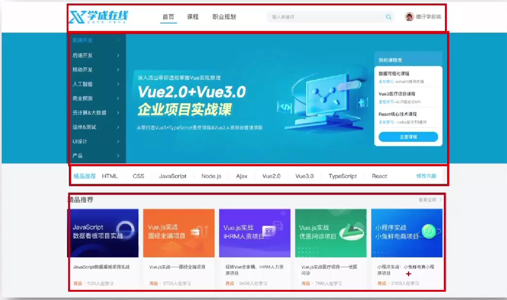{:width=200 height=200}
可以看到页面中所有部分都设置了版心居中，因此设置一个wrapper类，只要将各部分添加上这个类，就可以实现版心居中，不用单独设置每个部分
```
.wrapper{
    margin: 0 auto;
    width: 1200px; /*要设置宽度*/
}
```
##### 网页制作思路
1. 布局思路：先整体再局部，从外到内、从上到下、从左到右
2. CSS思路：
   1. 画盒子并调整盒子基本属性（宽高背景色）
   2. 调整盒子位置（flex布局、内外边距等）
   3. 控制图片、文字内容样式
### header区域布局
##### 大体结构
header区域背景色为白色，中间是蓝色，剩下的内容区是浅灰色。由于内容区域最大，可以认为整个页面的背景色是浅灰色，另外两部分再单独设置
```
body{
    background-color: #f3f5f7;
}
```
***
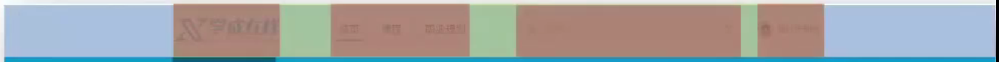{:width=20 height=20}
header区域最外层是一个宽度与浏览器窗口相同的盒子（称为**通栏**）
标签结构：通栏>版心>logo+导航+搜素+用户
其中通栏可以不给宽度，这样它的宽度就与父级（浏览器窗口）相同；4个小块横向排列，可以使用flex布局（加到它们的父级，即header里的wrapper上）
```
<!-- 头部区域 -->
<div class="header">
    <div class="wrapper">
        <!-- logo -->
        <div class="logo">logo</div>
        <!-- 导航 -->
        <div class="nav">导航</div>
        <!-- 搜索 -->
        <div class="search">搜索</div>
        <!-- 用户 -->
        <div class="user">用户</div>
    </div>
</div>
```
```
body{
    background-color: #f3f5f7;
}
/*头部区域*/
.header{
    height: 100px;
    background-color: #fff;
}
.header .wrapper{
    padding-top: 29px; /*使里面的4个元素与顶端有一定距离*/
    display: flex;
}
```
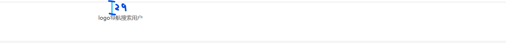{:width=50 height=50}
##### logo
功能：
- 单击跳转到首页（添加a标签）
- 搜索引擎优化（添加h1标签）

实现方法：
- 标签结构：`<h1><a>网站名称（搜索关键字）</a></h1>`
- CSS：
  - 为使a标签的宽高生效，设置成块级元素
  - 隐藏搜索关键字（只需展示logo），设置字体大小为0
##### 导航
功能：单击跳转页面
实现方法：
- `<ul><li><a></a></li>*3</ul>`避免堆砌a标签，使网站搜索排名下降
- 加左间距，使导航区域与logo区域有一定间隔
- 使三个li横向排列，给ul使用flex布局
- 间距设置：
    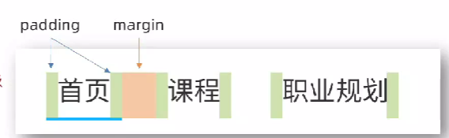{:width=80 height=80}
  - li设置右侧margin
  - a设置左右padding
- 鼠标经过哪个li，哪个li就显示特殊样式（下划线）
##### 搜索
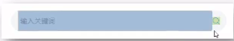{:width=40 height=40}
分为输入框和右侧放大镜图标两部分
标签结构：`.search`>`input`+`a/button`
因为横向排列，所以父级flex布局
##### 用户
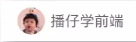{:width=40 height=40}
标签结构：`.user`>`a`>`img`+`span`
因为点击用户头像和名称都需要跳转，所以用a标签将img和span套起来
### banner区域
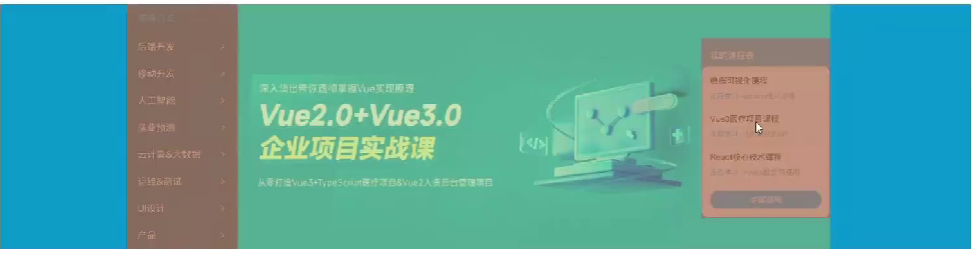{:width=150 height=150}
结构：`通栏banner`>`版心wrapper`（设置背景图片--绿色区域）>`.left`+`.right`（两个红色区域）
left和right横向排列--使用flex布局，因为一左一右，相当于空白间距在弹性盒子之间，所以设置主轴对齐方式为`space-between`
##### left
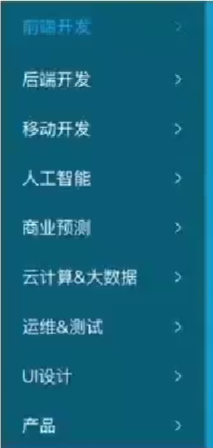{:width=150 height=150}
标签结构：`.left`>`ul`>`li`*9>`a`
因为li中的文字是链接，所以使用li嵌套a；
因为小箭头只作装饰，所以使用a的背景图片显示它
##### right
{:width=200 height=200}
标签结构：`.right`>`h3`+`.content`
content区域：
有一个课程列表和按钮（可用a标签）
课程列表使用`dl`>`dt`+`dd`的结构，其中dl是自定义列表项，dt是列表项标题，dd是列表项内容。
```
<dl>
    <dt>数据可视化课程</dt>
    <dd><span>正在学习</span>-<strong>echarts使用步骤</strong></dd>
</dl>
<dl>
    <dt>数据可视化课程</dt>
    <dd><span>正在学习</span>-<strong>echarts使用步骤</strong></dd>
</dl>
<dl>
    <dt>数据可视化课程</dt>
    <dd><span>正在学习</span>-<strong>echarts使用步骤</strong></dd>
</dl>
```
其中`正在学习`和`echarts使用步骤`都需要设置样式，所以放入标签中，`echarts使用步骤`较重要，用strong标签
每个列表项间的下划线只需用`border-bottom`设置即可
### 精品推荐
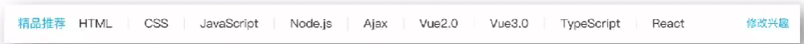{:width=30 height=30}
标签结构：`.recommend`>`h3`（精品推荐）+`ul`+`a`（修改兴趣）
因为`修改兴趣`点击后跳转，所以用a标签，因为列表中的li也需要使用a标签，为方便CSS找到`修改兴趣`，为它添加类名modify；
因为h3 ul a横向排列，所以用flex布局；列表横向排列，也用flex布局；
因为该区域版心居中，且不用设置背景图片，直接为最外层的.recommend添加类名wrapper即可；
如何实现让`精品推荐`和`修改兴趣`分别靠最左和最右，列表居中：给列表设置`flex:1;`
如何制作两个列表项之间的小竖线：因为竖线与文字等高，所以为列表项a标签添加右边框线，再给最后1个a取消右边框线；此时因为文字与右边框线间有距离，所以添加左右padding。还有一个关键之处--此处a是行内元素，可以让多个小竖线在一行内显示
### 精品课程
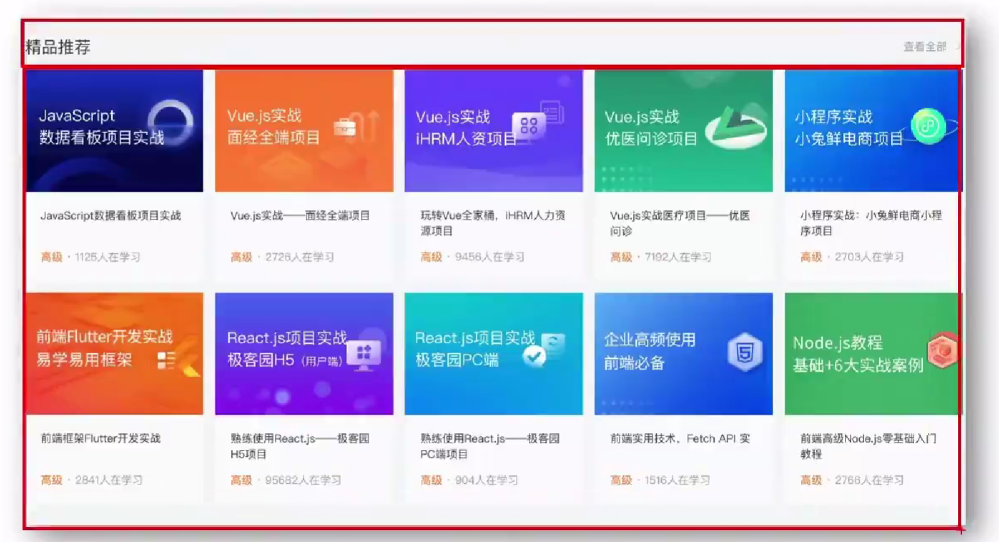{:width=300 height=300}
标签结构：`.course`>`.hd`（标题区域）+`.bd`（内容区域）
因为该区域版心居中，且不用设置背景图片，直接为最外层的.course添加类名wrapper即可。
`.hd`：左侧的`h3`（精品推荐），右侧的`a`（查看全部）；使用flex横向布局，主轴对齐方式为`space-between`使一左一右。最右侧的小箭头使用背景图，为让"查看全部"与箭头有距离，为a加上右padding，使文字左移，为箭头留出空间。
注意：因为之后的各区域也都采用类似精品课程区域的结构，这里的`.hd`和`.bd`要考虑样式共用--在写CSS时写`.hd h3`而不是`.course .hd h3`。
`.bd`：ul嵌套li，ul使用flex布局，弹性换行`flex-wrap: wrap;`；各盒子间左右有间距：主轴对齐方式`space-between`；上下间距直接给li添加margin-bottom
`li`：`a`>`课程图片.pic`+`课程描述.text`，因为想要点击li就跳转，把a放在外层
`.text`：`h4`（课程名称）+`p`(`span`（高级）+`i`（人数）+`其它内容`)，即`<p><span>高级</span>·<i>1125</i>人在学习</p>`
观察结果图片，可以看到课程名称有1行的有2行的，在确定h4的高度和与p间距时，应以2行的为准
### 前端开发工程师
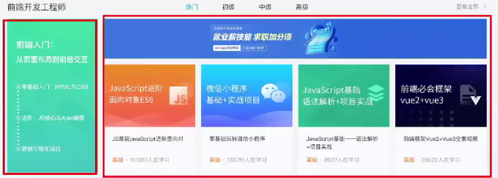{:width=200 height=200}
标签结构：`.kaifa`>`.hd`+`.bd`
因为该区域版心居中，且不用设置背景图片，直接为最外层的.kaifa添加类名wrapper即可。
`.hd`：在前面公共样式的基础上，加上中间的横向列表，只需为ul设置flex即可（因为前面已设置`space-between`）
`.bd`：分为`.left`和`.right`（上图的两个红框），先分别为这两个区域设置宽（高由内容撑开），为使它们放在盒子最左和最右，设置主轴对齐方式`space-between`
`.right`：分为上面的图片`.top`和下面的横向列表`.bottom`，因为前面已经写了横向列表的样式，直接复制前面的li代码块到HTML就行，无需再写CSS（因为公共样式是`.bd li`，`.bottom`在`.bd`内，li可以被选中
如果发现li没有间距，`space-between`没有生效，是由于ul没有宽度，网页无法计算剩余宽度并分配，解决办法：给ul设置宽度，对于此例可以给ul添加CSS`width: 100%;`
### 版权区域
{:width=100 height=100}
需要设置背景色，所以`.footer`>`.wrapper`>`.left`+`.right`，左右两部分横向排列并分别在最左和最右，给wrapper添加flex，同时主轴对齐方式`space-between`
`.left`：上面图标用a标签套img（因为是版权区域所以无需SEO优化），中间文字直接p标签，最下面下载按钮用a标签。它们的间距直接用p的margin-top/bottom设置就可以
`.right`：三个列表，采用前面的`dl`>`dt`+`dd`形式，其中dd里面嵌套a标签。因为三个`dl`横向排列，所以flex