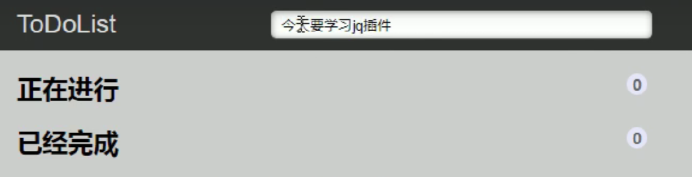
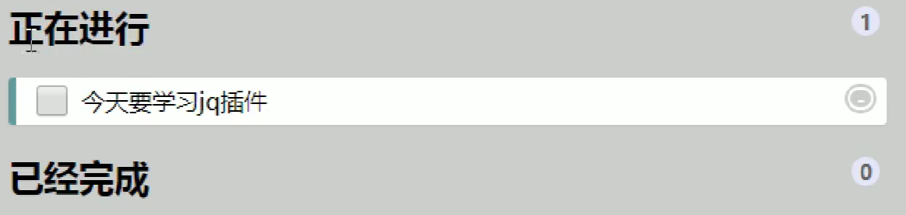
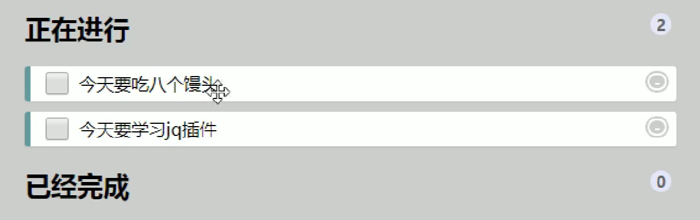
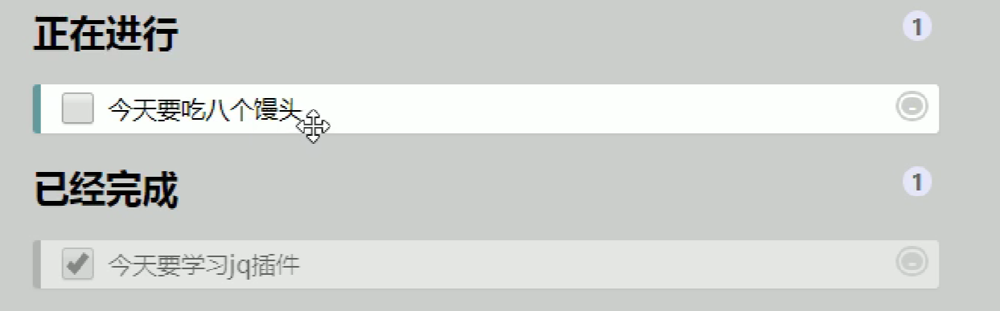
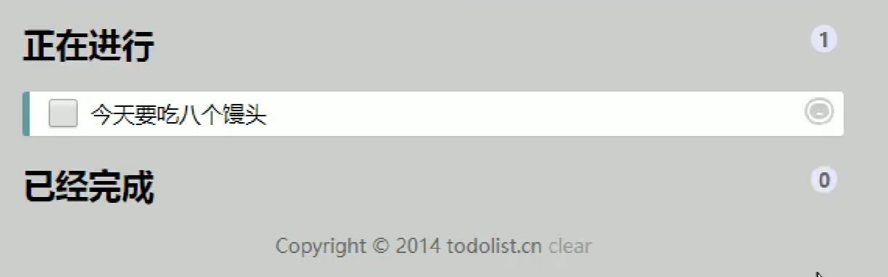

### 说明
1. 文本框里面输入内容，按回车，就可以生成待办事项。
   {:width=80 height=80}
   按下回车
    {:width=80 height=80}
2. 点击待办事项复选框，就可以把当前数据添加到已完成事项里面。
    {:width=80 height=80}
   点击复选框
    {:width=80 height=80}
3. 点击已完成事项复选框,就可以把当前数据添加回到待办事项里面。
    {:width=80 height=80}
    点击复选框
    {:width=80 height=80}
4. 点击右侧的单选按钮可以删除事项
    {:width=80 height=80}
    点击后
    {:width=80 height=80}
5. 刷新页面内容不会丢失。
### 分析
因为刷新页面不会丢失，因此需要用到本地存储；
不管是按回车还是点击复选框，都是读写本地存储中的数据，并将其渲染到页面中；
因为存储的数据包括**事项内容**以及**是否完成**，格式为`[{title:"xxx",done:false},]`；
因为本地存储只能存字符串格式，需要把对象转为字符串`JSON.stringify(data)`，取的时候再转回来`JSON.parse(data)`。
##### 按回车把新数据添加到本地存储中
1. `event.keyCode`==13表示按下回车键
2. 读取本地存储中原有的数据，放到一个数组中
3. 把文本框中新数据追加到此数组中
4. 把新数组本地存储，替代原有数据
##### 本地存储数据渲染加载到页面
1. 因为后面还要使用，所以封装到函数中
2. 先读取数据并转换成对象格式
3. each方法遍历数据，有几条数据就生成几个小li到列表中
4. 注意：添加li前要把列表的原有内容清空，否则会重复加载
##### 删除
1. 删除不是删除小li，而是删除本地存储中的数据
2. 重点是获取li对应在本地存储数据的索引号，不能直接使用`.index()`，因为只有jq对象是亲兄弟时才可以，此例中点击的是a标签，而a嵌套在li中，a.index()无意义；同时此例中有2个列表，两列表中元素也没有亲兄弟关系
3. 可以给a自定义属性记录当前索引号，prepend时``
4. 使用`splice(i,1)`进行删除
5. 修改后的数据存入本地存储，并进行渲染
6. 注意：因为a是动态创建的（通过prepend方法），因此使用on方法绑定事件
##### 正在进行/已完成状态切换
1. 点击复选框修改对应数据的done为当前复选框的checked状态
2. 修改后的数据存入本地存储，并进行渲染
##### 统计列表项个数
1. 在加载函数中进行
2. 声明两个计数变量，遍历时对变量自增操作
3. 最后修改对应元素的文本值